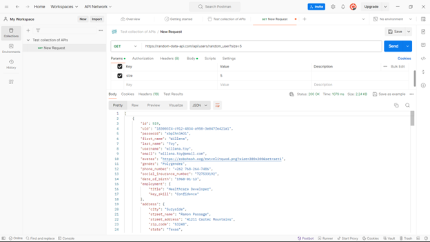
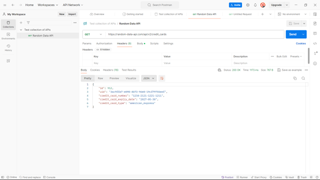

**Họ và tên: đoàn đình khôi -20010777**

\# Báo cáo Bài Thực Hành Postman với API Random Data

\## Giới thiệu

Bài thực hành này hướng dẫn cách sử dụng công cụ Postman để kiểm thử API từ trang \[Random Data API\](<https://random-data-api.com/>). Mục tiêu là giúp sinh viên nắm bắt được cách gửi yêu cầu HTTP và phân tích phản hồi từ server.

\## Các bước thực hiện

\### 1. Cài đặt và thiết lập Postman

\- Tải và cài đặt Postman từ trang chủ: \[Postman Download\](<https://www.postman.com/downloads/>)

\- Tạo một tài khoản Postman nếu chưa có.

\### 2. Gửi yêu cầu GET để lấy dữ liệu ngẫu nhiên

\- \*\*Mở Postman và tạo một yêu cầu mới:\*\*

\- Nhấp vào "New" > "HTTP Request".

\- Chọn phương thức \`GET\` và nhập URL của API:

\`\`\`

<https://random-data-api.com/api/users/random_user>

\`\`\`

\- Nhấp vào "Send" để gửi yêu cầu và kiểm tra phản hồi.

\- \*\*Kết quả:\*\* Bạn sẽ nhận được một phản hồi JSON chứa thông tin ngẫu nhiên của một người dùng.

\### 3. Gửi yêu cầu GET với tham số để lấy nhiều dữ liệu ngẫu nhiên

\- \*\*Gửi yêu cầu lấy nhiều người dùng ngẫu nhiên:\*\*

\- Chọn phương thức \`GET\` và nhập URL của API với tham số \`size\` để lấy nhiều bản ghi:

\`\`\`

<https://random-data-api.com/api/users/random_user?size=5>

\`\`\`

\- Nhấp vào "Send" để gửi yêu cầu và kiểm tra phản hồi.

\- \*\*Kết quả:\*\* Bạn sẽ nhận được một mảng JSON chứa thông tin ngẫu nhiên của 5 người dùng.

\### 4. Gửi yêu cầu POST (API này không hỗ trợ POST, minh họa với API khác)

\- \*\*Tạo một yêu cầu mới:\*\*

\- Nhấp vào "New" > "HTTP Request".

\- Chọn phương thức \`POST\` và nhập URL của một API có hỗ trợ POST (ví dụ: \`<https://jsonplaceholder.typicode.com/posts\`>).

\- Chuyển đến tab "Body" và chọn "raw" với định dạng \`JSON\`.

\- Nhập dữ liệu JSON cần gửi (ví dụ):

\`\`\`json

{

"title": "foo",

"body": "bar",

"userId": 1

}

\`\`\`

\- Nhấp vào "Send" để gửi yêu cầu và kiểm tra phản hồi.

\- \*\*Kết quả:\*\* Bạn sẽ nhận được phản hồi JSON xác nhận dữ liệu đã được gửi thành công.

\### 5. Sử dụng Collections để tổ chức các yêu cầu

\- \*\*Tạo một collection mới:\*\*

\- Nhấp vào "Collections" > "New Collection".

\- Đặt tên cho collection (ví dụ: "Random Data API").

\- Lưu các yêu cầu đã thực hiện vào collection này để dễ dàng truy cập lại sau.

\### 6. Kiểm thử tự động với Tests

\- \*\*Thêm script kiểm thử trong tab "Tests" của yêu cầu:\*\*

\- Ví dụ, kiểm tra mã trạng thái là 200 và một số kiểm thử khác:

\`\`\`javascript

pm.test("Status code is 200", function () {

pm.response.to.have.status(200);

});

pm.test("Response time is less than 500ms", function () {

pm.expect(pm.response.responseTime).to.be.below(500);

});

pm.test("Response has user_id", function () {

var jsonData = pm.response.json();

pm.expect(jsonData).to.have.property('id');

});

\`\`\`

\- \*\*Kết quả:\*\* Khi gửi yêu cầu, Postman sẽ tự động kiểm tra và báo cáo kết quả kiểm thử:

\- \*\*Status code is 200\*\*: Mã trạng thái HTTP của phản hồi là 200.

\- \*\*Response time is less than 500ms\*\*: Thời gian phản hồi là dưới 500ms.

\- \*\*Response has user_id\*\*: Phản hồi chứa thuộc tính \`id\`.

**KẾT LUẬN:**

Qua bài thực hành này, sinh viên đã làm quen với công cụ Postman và cách sử dụng nó để kiểm thử các API từ \[Random Data API\](<https://random-data-api.com/>). Postman là một công cụ mạnh mẽ và dễ sử dụng, giúp đơn giản hóa quá trình phát triển và kiểm thử ứng dụng.
